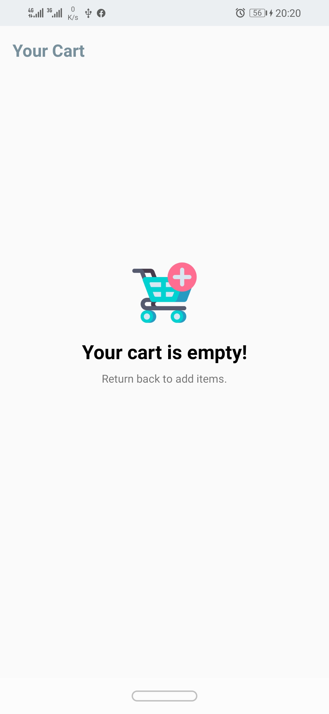

# E commerce app

E commerce android app let the users to buy products online

## Table of contents
* [General info](#general-info)
* [Screenshots](#screenshots)
* [Technologies](#technologies)
* [Setup](#setup)
* [Feedback](#feedback)
* [License](#license)

## General info

it's a traning project created with woo commerce api, included with all functionality related of e commerce.
ex: signup, home, details, cart, wishlist, checkout screens expect payment gateway, i will add it soon.

## Screenshots

 

## Technologies

### Languages:
- Java 
- xml

### Architecture patterns:
- MVVM

### Android components:
- Activity 
- Fragemnt
- Broadcast receiver

### Libraries:
- Retrofit 2.9.0 (https://square.github.io/retrofit/)
- Room 2.2.5 (https://developer.android.com/training/data-storage/room)
- Picasso 2.71828 (https://square.github.io/picasso/)
- View Model, Live Data, View binding 2.2.0 (https://developer.android.com/jetpack/androidx/releases/lifecycle)
- RxJava 3.0.0 (https://github.com/ReactiveX/RxJava)
- Facebook Shimmer 0.4.0 (https://github.com/facebook/shimmer-android)

